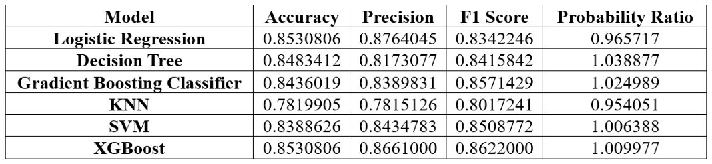

# Heart Disease Prediction Application (HeartSense)

## Overview
This project is a machine learning-based heart disease prediction application built using Python. It utilizes multiple classification models to predict the likelihood of heart disease based on user-inputted medical parameters. The application is implemented using the `Gradio` library for an interactive interface and several machine learning models for prediction.

Try it here: https://huggingface.co/spaces/MrAR/HeartSense

## Features
- **Data Preprocessing**: The dataset is cleaned by removing duplicates and handling outliers using the Interquartile Range (IQR) method.
- **Feature Encoding**: Categorical variables are label-encoded for compatibility with machine learning models.
- **Data Splitting & Scaling**: The dataset is split into training and testing sets (70%-30%) and continuous variables are standardized.
- **Multiple Model Training**: The following machine learning models are trained and evaluated:
  - Logistic Regression
  - Decision Tree
  - Gradient Boosting
  - K-Nearest Neighbors (KNN)
  - Support Vector Machine (SVM)
  - Random Forest
  - XGBoost
- **Model Evaluation**: Performance metrics such as accuracy, precision, recall, and F1-score are computed for each model.
- **Prediction with Weighted Models**: User inputs are processed, and multiple models contribute to a weighted prediction.
- **Interactive Web Interface**: The application provides a simple UI for inputting patient details and receiving predictions.

## Dataset
The dataset used in this project is `dataset.csv`, which includes medical attributes like:
- **Age**
- **Resting Blood Pressure (RestingBP)**
- **Cholesterol Levels**
- **Maximum Heart Rate (MaxHR)**
- **Oldpeak (ST Depression Induced by Exercise)**
- **Fasting Blood Sugar (FastingBS)**
- **Sex**
- **Chest Pain Type**
- **Resting Electrocardiographic Results (RestingECG)**
- **Exercise-Induced Angina**
- **ST Slope**
- **Heart Disease (Target Variable)**


## Running the Application
### Steps to Use
1. Clone the repository:
   ```bash
   git clone https://github.com/ArnavAgarwal-Mr-AR/HeartSense.git
   cd HeartSense
   ```
2. Install the required dependencies:
   ```bash
   pip install -r requirements.txt
   ```
3. Ensure the dataset `dataset.csv` is present in the project directory.
4. Run the application:
   ```bash
   python app.py
   ```
5. Open the provided Gradio link in your browser to interact with the application.

## How It Works


1. **Data Preprocessing:**
   - Duplicate rows are removed.
   - Outliers in continuous features are removed using the IQR method.
   - Categorical features are encoded using label encoding.
   - Data is split into training and testing sets.
   - Continuous features are standardized using `StandardScaler`.
2. **Model Training:**
   - Various classification models are trained on the dataset.
   - Evaluation metrics are computed.
   - A weighted metric is computed for model comparison.
   
   
   
   
4. **Prediction:**
   - User inputs are transformed into a format suitable for the models.
   - Predictions are generated from all trained models.
   - A weighted aggregation method determines the final prediction.

 
5. **User Interface:**
   - Users input medical details via a Gradio interface.
   - The system predicts the likelihood of heart disease and provides a message based on risk assessment.

  


## Expected Output
- If the model predicts a high risk of heart disease, the output will be:
  - "You might get a heart stroke, take precautions."
- If the model predicts a low risk, the output will be:
  - "You are safe."

## Model Formulations
The mathematical formulations used in model evaluation and prediction:


## Future Enhancements
- Improve model selection based on feature importance.
- Implement deep learning-based models for better accuracy.
- Deploy the application using cloud platforms like AWS or Heroku.
- Include visualizations for better user understanding.

## Contact me 📪
<div id="badges">
  <a href="https://www.linkedin.com/in/arnav-agarwal-571a59243/" target="blank">
   
  </a>
 <a href="https://www.instagram.com/arnav_executes?igsh=MWUxaWlkanZob2lqeA==" target="blank">
 
 </a>
 </a>
 <a href="https://medium.com/@arumynameis" target="blank">
 
 </a>
</div>
